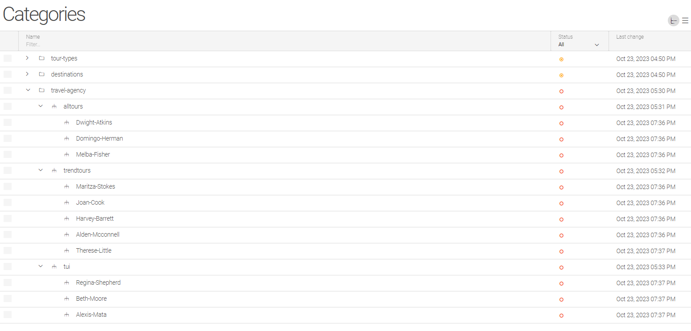
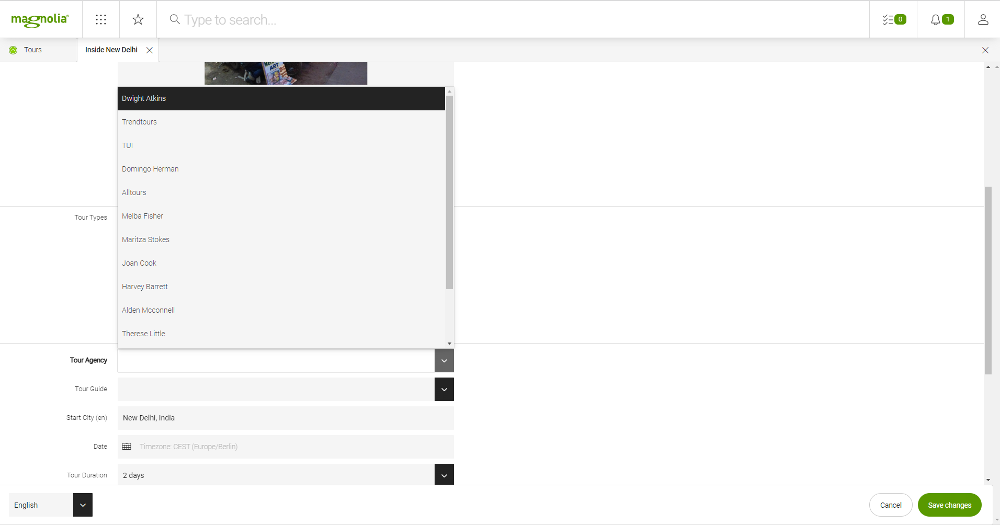
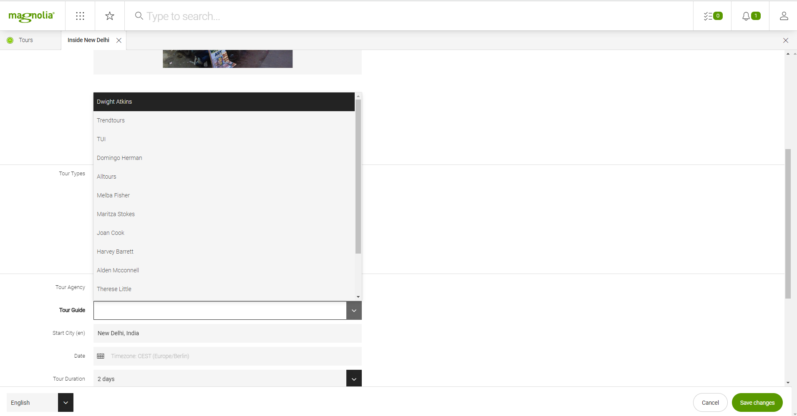

== travel agency guides

I want to provide every tour with an agency.
The Agency has a list of tour guides I want to select from for that tour.

https://docs.magnolia-cms.com/headless/getting-started-with-magnolia-headless/hello-headless.html[Base-Example]

[source,bash]
----
cp -r ../from_git/basic-headless-demos/magnolia magnolia
cd magnolia
mgnl jumpstart
# 2

# Now, pick up some handy configuration and sample images.
cp -r ../../from_git/basic-headless-demos/magnolia/_dev/content-to-bootstrap/* ./apache-tomcat/webapps/magnoliaAuthor/WEB-INF/bootstrap/common

mgnl start

browser http://localhost:8080
# Click Run the Web update on the author instance.
# login superuser/superuser
----

* Add tour-agency as category

* add guides per agency

* Wanted: select agency and select guide form that agency

* But I have a mixture of agencies and guides

=== Doku

* https://docs.magnolia-cms.com/product-docs/6.2/Features/Content-Types.html#_content_type_property_suffixes[type definitions]
* https://docs.magnolia-cms.com/product-docs/6.2/Developing/Templating/Dialog-definition/Field-definition/List-of-fields.html[dialog input fields]

